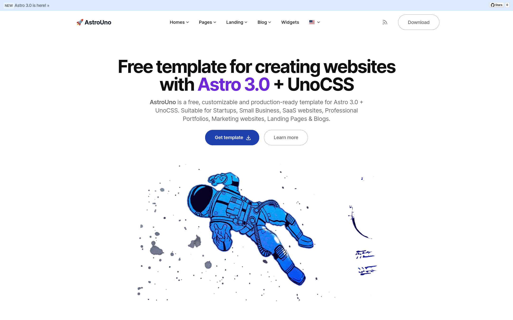

# 🚀 AstroUno

**AstroUno** is a free and open-source template to make your website using **[Astro 3.0](https://astro.build/) + [UnoCSS](https://unocss.dev/)**. Ready to start a new project and designed taking into account web best practices.

- ✅ **Production-ready** scores in **PageSpeed Insights** reports.
- ✅ Integration with **UnoCSS** supporting **Dark mode** and **_RTL_**.
- ✅ **Fast and SEO friendly blog** with automatic **RSS feed**, **MDX** support, **Categories & Tags**, **Social Share**, ...
- ✅ **Image Optimization** (using new **Astro Assets** and **Unpic** for Universal image CDN).
- ✅ Generation of **project sitemap** based on your routes.
- ✅ **Open Graph tags** for social media sharing.
- ✅ **Analytics** built-in Google Analytics, and Splitbee integration.

<br>



[](https://github.com/jceb/astrouno/blob/main/LICENSE.md)
[](https://github.com/jceb)
[](https://github.com/jceb/astrouno#contributing)
[](https://snyk.io/test/github/jceb/astrouno)
[](https://github.com/jceb/astrouno)
[](https://github.com/jceb/astrouno)

<br>

<details open>
<summary>Table of Contents</summary>

- [Demo](#demo)
- [Getting started](#getting-started)
  - [Project structure](#project-structure)
  - [Commands](#commands)
  - [Configuration](#configuration)
  - [Deploy](#deploy)
- [Frequently Asked Questions](#frequently-asked-questions)
- [Related Projects](#related-projects)
- [Contributing](#contributing)
- [Acknowledgements](#acknowledgements)
- [License](#license)

</details>

<br>

## Demo

📌 [https://astrouno.vercel.app/](https://astrouno.vercel.app/)

<br>

## Getting started

**AstroUno** tries to give you quick access to creating a website using [Astro 3.0](https://astro.build/) + [UnoCSS](https://unocss.dev/). It's a free theme which focuses on simplicity, good practices and high performance.

Very little vanilla javascript is used only to provide basic functionality so that each developer decides which framework (React, Vue, Svelte, Solid JS...) to use and how to approach their goals..

### Project structure

Inside AstroUno template, you'll see the following folders and files:

```
/
├── public/
│   ├── _headers
│   └── robots.txt
├── src/
│   ├── assets/
│   │   ├── favicons/
│   │   ├── images/
│   │   └── styles/
│   │       └── uno.css
│   ├── components/
│   │   ├── blog/
│   │   ├── common/
│   │   ├── ui/
│   │   ├── widgets/
│   │   │   ├── Header.astro
│   │   │   └── ...
│   │   ├── CustomStyles.astro
│   │   ├── Favicons.astro
│   │   └── Logo.astro
│   ├── content/
│   │   ├── post/
│   │   │   ├── post-slug-1.md
│   │   │   ├── post-slug-2.mdx
│   │   │   └── ...
│   │   └── config.ts
│   ├── i18n/
│   │   └── ui.ts
│   ├── icons/
│   │   ├── your-icon.svg
│   │   └── ...
│   ├── layouts/
│   │   ├── Layout.astro
│   │   ├── MarkdownLayout.astro
│   │   └── PageLayout.astro
│   ├── pages/
│   │   ├── [...blog]/
│   │   │   ├── [category]/
│   │   │   ├── [tag]/
│   │   │   ├── [...page].astro
│   │   │   └── index.astro
│   │   ├── index.astro
│   │   ├── 404.astro
│   │   ├-- rss.xml.ts
│   │   └── ...
│   ├── utils/
│   ├── config.yaml
│   └── navigation.js
├── package.json
├── astro.config.mjs
└── ...
```

Astro looks for `.astro` or `.md` files in the `src/pages/` directory. Each page is exposed as a route based on its file name.

There's nothing special about `src/components/`, but that's where we like to put any Astro/React/Vue/Svelte/Preact components.

Any static assets, like images, can be placed in the `public/` directory if they do not require any transformation or in the `assets/` directory if they are imported directly.


[](https://githubbox.com/jceb/astrouno/tree/main)  [](https://gitpod.io/?on=gitpod#https://github.com/jceb/astrouno)  [](https://stackblitz.com/github/jceb/astrouno)   

> 🧑‍🚀 **Seasoned astronaut?** Delete this file `README.md`. Update `src/config.yaml` and contents. Have fun!

<br>

### Commands

All commands are run from the root of the project, from a terminal:

| Command               | Action                                             |
| :-------------------- | :------------------------------------------------- |
| `npm install`         | Installs dependencies                              |
| `npm run dev`         | Starts local dev server at `localhost:3000`        |
| `npm run build`       | Build your production site to `./dist/`            |
| `npm run preview`     | Preview your build locally, before deploying       |
| `npm run format`      | Format codes with Prettier                         |
| `npm run lint:eslint` | Run Eslint                                         |
| `npm run astro ...`   | Run CLI commands like `astro add`, `astro preview` |

<br>

### Configuration

Basic configuration file: `./src/config.yaml`

```yaml
site:
  name: AstroUno
  site: 'https://astrouno.vercel.app'
  base: '/' # Change this if you need to deploy to Github Pages, for example
  trailingSlash: false # Generate permalinks with or without "/" at the end

  googleSiteVerificationId: false # Or some value,

# Default SEO metadata
metadata:
  title:
    default: AstroUno
    template: '%s — AstroUno'
  description: "\U0001F680 Suitable for Startups, Small Business, Sass Websites, Professional Portfolios, Marketing Websites, Landing Pages & Blogs."
  robots:
    index: true
    follow: true
  openGraph:
    site_name: AstroUno
    images:
      - url: '~/assets/images/default.png'
        width: 1200
        height: 628
    type: website
  twitter:
    handle: '@jceb'
    site: '@jceb'
    cardType: summary_large_image

i18n:
  # Configure languages and translations in ./i18n/ui.ts
  language: en
  textDirection: ltr
  showDefaultLanguageInURL: false

apps:
  blog:
    isEnabled: true
    postsPerPage: 6

    post:
      isEnabled: true
      permalink: '/%slug%' # Variables: %slug%, %year%, %month%, %day%, %hour%, %minute%, %second%, %category%
      robots:
        index: true

    list:
      isEnabled: true
      pathname: 'blog' # Blog main path, you can change this to "articles" (/articles)
      robots:
        index: true

    category:
      isEnabled: true
      pathname: 'category' # Category main path /category/some-category, you can change this to "group" (/group/some-category)
      robots:
        index: true

    tag:
      isEnabled: true
      pathname: 'tag' # Tag main path /tag/some-tag, you can change this to "topics" (/topics/some-category)
      robots:
        index: false

analytics:
  vendors:
    googleAnalytics:
      id: null # or "G-XXXXXXXXXX"

ui:
  showAnnouncement: true
  header:
    isSticky: true
    showLanguagePicker: true
    showToggleTheme: false
    showRssFeed: true

  theme: 'system' # Values: "system" | "light" | "dark" | "light:only" | "dark:only"

  tokens:
    default:
      fonts:
        sans: InterVariable
        serif: var(--ph-font-sans)
        heading: var(--ph-font-sans)
      colors:
        default: rgb(16 16 16)
        heading: rgb(0 0 0)
        muted: rgb(40 40 40)
        bgPage: rgb(255 255 255)
        primary: rgb(0 124 220)
        secondary: rgb(30 58 138)
        accent: rgb(109 40 217)
        info: rgb(119 182 234)
        success: rgb(54 211 153)
        warning: rgb(251 189 35)
        error: rgb(248 114 114)
        link: var(--ph-color-primary)
        linkActive: var(--ph-color-link)
    dark:
      fonts: {}
      colors:
        default: rgb(247, 248, 248)
        heading: rgb(247, 248, 248)
        muted: rgb(200, 188, 208)
        bgPage: rgb(3 6 32)
        primary: rgb(29 78 216)
        secondary: rgb(30 58 138)
        accent: rgb(135 77 2267)
        info: rgb(58 191 248)
        success: rgb(54 211 153)
        warning: rgb(251 189 35)
        error: rgb(248 114 114)
        link: var(--ph-color-primary)
        linkActive: var(--ph-color-link)
```

<br>

### Deploy

#### Deploy to production (manual)

You can create an optimized production build with:

```shell
npm run build
```

Now, your website is ready to be deployed. All generated files are located at
`dist` folder, which you can deploy the folder to any hosting service you
prefer.

#### Deploy to Netlify

Clone this repository on own GitHub account and deploy to Netlify:

[](https://app.netlify.com/start/deploy?repository=https://github.com/jceb/astrouno)

#### Deploy to Vercel

Clone this repository on own GitHub account and deploy to Vercel:

[](https://vercel.com/new/clone?repository-url=https%3A%2F%2Fgithub.com%2Fjceb%2Fastrouno)

<br>

## Related projects

- [astrowind](https://github.com/onwidget/astrowind) - Astro + Tailwind CSS.

## Contributing

If you have any idea, suggestions or find any bugs, feel free to open a discussion, an issue or create a pull request.
That would be very useful for all of us and we would be happy to listen and take action.

## Acknowledgements

Initially created by [onWidget](https://onwidget.com) and maintained by a community of [contributors](https://github.com/jceb/astrouno/graphs/contributors).

## License

**AstroUno** is licensed under the MIT license — see the [LICENSE](./LICENSE.md) file for details.
